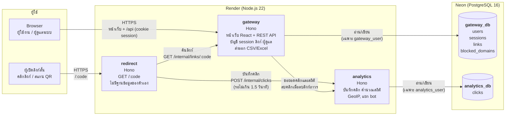
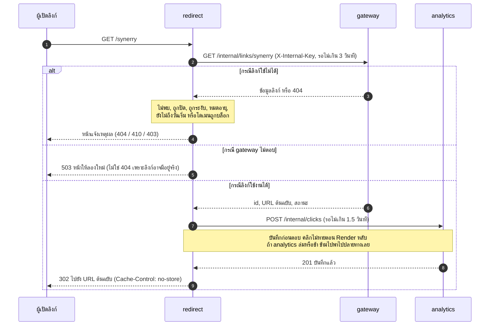

# Architecture

ระบบแบ่งเป็น 3 microservice ที่ deploy แยกกัน และหน้าเว็บ React ที่ gateway เป็นผู้เสิร์ฟ แต่ละ service เป็นเจ้าของข้อมูลของตัวเอง และคุยกันผ่าน HTTP ภายในที่ต้องแนบ key ลับ (`X-Internal-Key`)

## ความรับผิดชอบของแต่ละ service

| service | หน้าที่ | ข้อมูลที่เป็นเจ้าของ | เปิดให้ภายนอก |
|---|---|---|---|
| **gateway** | เสิร์ฟหน้าเว็บ, สมัคร/เข้าสู่ระบบ (session), สร้างและจัดการลิงก์, ถังขยะ, หน้าผู้ดูแล, ส่งออก CSV/Excel, ตรวจ blocklist, ตรวจสิทธิ์ความเป็นเจ้าของก่อนขอสถิติ | `users`, `sessions`, `links`, `blocked_domains` | หน้าเว็บ และ `/api/*` |
| **redirect** | รับการเปิดลิงก์สั้น ตรวจสถานะ แล้วพาไปปลายทาง หรือแสดงหน้าแจ้งเหตุผล | ไม่มี (stateless) | `/:code` |
| **analytics** | บันทึกคลิก (อุปกรณ์ browser OS ประเทศ แยก bot hash IP) และคำนวณสถิติ | `clicks` | ไม่มี (ภายในเท่านั้น) |

## เมื่อมีคนเปิดลิงก์สั้น

## การตัดสินใจสำคัญ

- **redirect แยกจาก gateway:** ทางเปิดลิงก์เป็นส่วนที่มีคนใช้มากที่สุด แยกออกมาเพื่อขยายได้อิสระ และไม่มีฐานข้อมูลของตัวเอง
- **รอบันทึกคลิกก่อนตอบ แต่มีเวลาจำกัด:** Render free tier หยุด process ได้หลังตอบ ถ้ายิงแล้วลืม คลิกจะหาย การรอไม่เกิน 1.5 วินาทีทำให้คลิกไม่หาย และ analytics ล่มก็ไม่ทำให้ลิงก์ใช้ไม่ได้
- **302 ไม่ใช่ 301:** browser จำ 301 ไว้ถาวร คลิกครั้งต่อไปจะไม่ผ่านเรา นับไม่ได้ และปิดลิงก์แล้วไม่มีผล
- **หน้าเว็บอยู่โดเมนเดียวกับ API:** cookie session ทำงานได้โดยไม่ต้องใช้ third-party cookie และไม่ต้องเปิด CORS
- **frontend ไม่เรียก analytics ตรง:** gateway ตรวจความเป็นเจ้าของก่อนเสมอ analytics จึงไม่ต้องรู้เรื่องผู้ใช้
- **analytics ล่ม ระบบหลักยังใช้ได้:** หน้าประวัติแสดงยอดคลิกเป็น "-" แทน 0 ที่ผิด และมีแถบแจ้งเตือน
