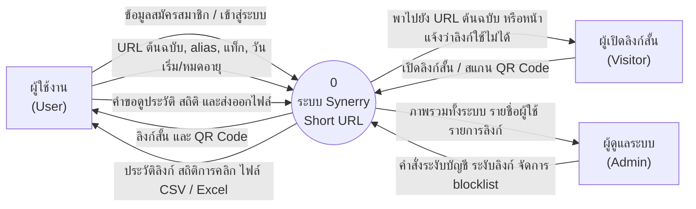
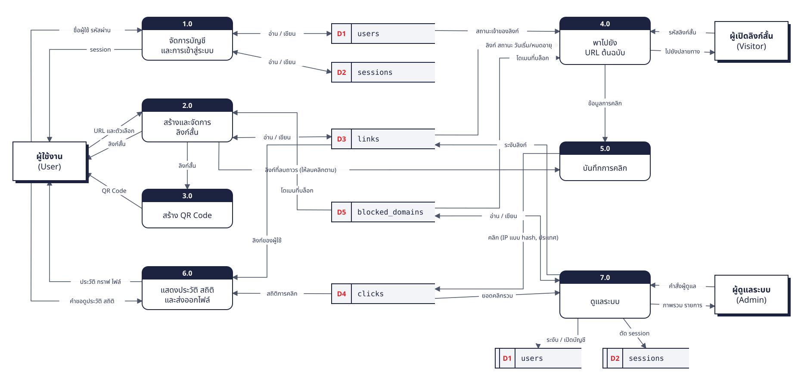

# Data Flow Diagram (DFD)

เอกสารนี้แสดงการไหลของข้อมูลในระบบ Synerry Short URL สองระดับ

- **Context Diagram** มองทั้งระบบเป็นกระบวนการเดียว เห็นว่าใครส่งข้อมูลอะไรเข้าและได้อะไรออกไป
- **DFD Level 0** แตกระบบออกเป็นกระบวนการหลัก 7 กระบวนการ พร้อมแหล่งเก็บข้อมูล (data store) ที่แต่ละกระบวนการอ่านและเขียน

สัญลักษณ์ที่ใช้

| สัญลักษณ์ | ความหมาย |
|---|---|
| สี่เหลี่ยม (มีเงา) | ผู้ที่อยู่นอกระบบ (external entity) |
| สี่เหลี่ยมมุมมน มีเลขกำกับ (ใน Context Diagram เป็นวงกลม) | กระบวนการ (process) |
| กล่องเปิดด้านขวา มีรหัส D นำหน้า | แหล่งเก็บข้อมูล (data store) ถ้ามีเส้นขีดเพิ่มในช่องรหัส คือวาดซ้ำ |
| ลูกศรพร้อมข้อความ | ข้อมูลที่ไหลระหว่างกัน (ลูกศรสองหัว = กระบวนการทั้งอ่านและเขียนแหล่งข้อมูลนั้น) |

## Context Diagram

## DFD Level 0

รูปนี้วาดด้วยสคริปต์ [`diagrams/dfd-level0.mjs`](diagrams/dfd-level0.mjs) กำหนดตำแหน่งเองทุกกล่อง (ตัววาดอัตโนมัติทำให้เส้นพันกันจนอ่านไม่ออก) แก้ไขแล้วสร้างรูปใหม่ด้วย `node docs/diagrams/dfd-level0.mjs`

กล่อง D1 และ D2 ที่มุมขวาล่าง (มีเส้นขีดเพิ่มในช่องรหัส) คือแหล่งข้อมูลเดียวกับด้านบน วาดซ้ำตามสัญลักษณ์มาตรฐานของ DFD เพื่อไม่ให้เส้นจาก 7.0 ลากข้ามทั้งรูป

## คำอธิบายกระบวนการ

| กระบวนการ | ทำอะไร | service ที่รับผิดชอบ |
|---|---|---|
| 1.0 จัดการบัญชีและการเข้าสู่ระบบ | สมัคร, เข้าสู่ระบบ, ออกจากระบบ, ตรวจ session, บันทึกว่าดูคู่มือแล้ว บัญชีที่ถูกระงับเข้าสู่ระบบไม่ได้ | gateway |
| 2.0 สร้างและจัดการลิงก์สั้น | ตรวจ URL (http/https เท่านั้น, ไม่ใช่โดเมนที่บล็อก), สร้างรหัสสั้นหรือใช้ alias, เตือน URL ซ้ำ, แก้ไข, เปิดปิด, ย้ายไปถังขยะ, กู้คืน, ลบถาวร | gateway |
| 3.0 สร้าง QR Code | สร้าง QR จากลิงก์สั้นในหน้าเว็บ ดาวน์โหลดเป็น PNG หรือ SVG | frontend (ทำงานใน browser) |
| 4.0 พาไปยัง URL ต้นฉบับ | ค้นลิงก์จากรหัส ตรวจสถานะ วันเริ่ม วันหมดอายุ blocklist และสถานะบัญชีเจ้าของ แล้วตอบ 302 หรือหน้าแจ้งเหตุผล | redirect (ค้นข้อมูลผ่าน gateway) |
| 5.0 บันทึกการคลิก | แยกอุปกรณ์/browser/OS, หาประเทศจาก IP, hash IP, แยก bot ออก แล้วบันทึก | analytics |
| 6.0 แสดงประวัติ สถิติ และส่งออกไฟล์ | ค้นหา กรองแท็ก แบ่งหน้า รวมยอดคลิก กราฟรายวัน แผนที่ประเทศ ส่งออก CSV/Excel | gateway (ขอยอดคลิกจาก analytics) |
| 7.0 ดูแลระบบ | ภาพรวมทั้งระบบ ระงับหรือเปิดบัญชี ระงับหรือยกเลิกการระงับลิงก์ จัดการ blocklist | gateway |

แหล่งเก็บข้อมูล D1, D2, D3 และ D5 อยู่ในฐานข้อมูล `gateway_db` ส่วน D4 อยู่ใน `analytics_db` (ดู [ER Diagram](er-diagram.md))
