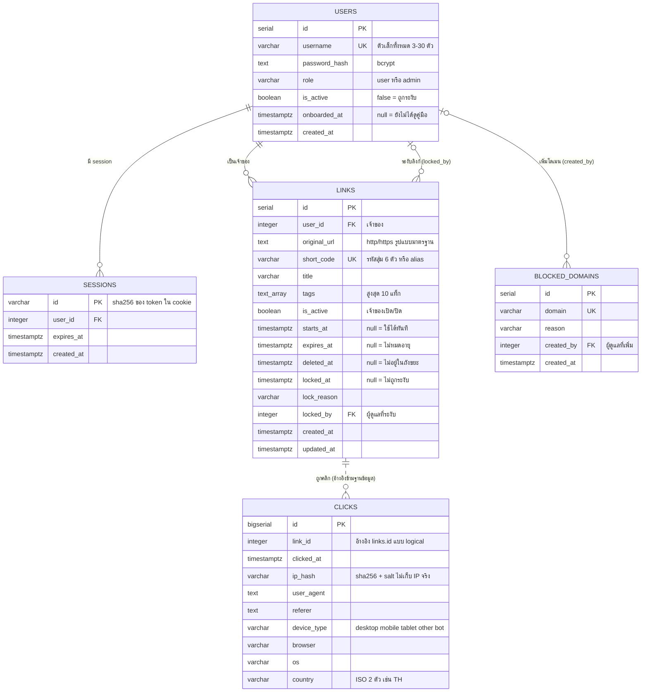

# ER Diagram

ระบบใช้ PostgreSQL สองฐานข้อมูล ตามหลัก database-per-service แต่ละ service เป็นเจ้าของข้อมูลของตัวเอง และมีสิทธิ์เชื่อมต่อเฉพาะฐานข้อมูลของตัวเอง

| ฐานข้อมูล | เจ้าของ | ตาราง |
|---|---|---|
| `gateway_db` | gateway service | `users`, `sessions`, `links`, `blocked_domains` |
| `analytics_db` | analytics service | `clicks` |

## ความสัมพันธ์

| ความสัมพันธ์ | ชนิด | เมื่อลบฝั่งหลัก |
|---|---|---|
| users 1 : N sessions | foreign key | ลบ session ตาม (cascade) |
| users 1 : N links (เจ้าของ) | foreign key | ลบลิงก์ตาม (cascade) |
| users 0..1 : N links (ผู้ดูแลที่ระงับ) | foreign key | ตั้งเป็น null การระงับยังอยู่ |
| users 0..1 : N blocked_domains (ผู้เพิ่ม) | foreign key | ตั้งเป็น null รายการยังอยู่ |
| links 1 : N clicks | **logical (เส้นประ)** ไม่มี foreign key เพราะอยู่คนละฐานข้อมูล | gateway สั่ง analytics ให้ลบคลิกผ่าน API ตอนลบลิงก์ถาวร |

## index ที่สร้างไว้

| ตาราง | index | ใช้กับ |
|---|---|---|
| links | `(user_id, created_at)` | หน้าประวัติ เรียงลิงก์ของผู้ใช้จากใหม่ไปเก่า |
| links | GIN บน `tags` | กรองประวัติตามแท็ก |
| links | unique บน `short_code` | redirect ค้นลิงก์จากรหัส และกันรหัสซ้ำ |
| sessions | `user_id` | ลบ session ทั้งหมดของผู้ใช้ตอนระงับบัญชี |
| clicks | `(link_id, clicked_at)` | สถิติของลิงก์หนึ่งตามช่วงเวลา |

## เหตุผลของการออกแบบที่สำคัญ

- **แยกฐานข้อมูลตาม service:** analytics ล่มหรือถูกเขียนหนักๆ ก็ไม่กระทบการสร้างลิงก์ และแต่ละ service ขยายหรือย้ายฐานข้อมูลได้อิสระ ข้อเสียคือไม่มี foreign key ข้ามฐานข้อมูล จึงต้องให้ gateway รับผิดชอบลบคลิกเมื่อลบลิงก์
- **session เก็บแค่ hash ของ token:** ถ้าฐานข้อมูลหลุด ก็เอาค่าไปสวมเป็น session ไม่ได้
- **clicks เก็บ ip_hash ไม่เก็บ IP จริง:** ยังนับผู้เข้าชมไม่ซ้ำได้ แต่ไม่เก็บข้อมูลส่วนบุคคล ประเทศหาจาก IP ก่อน hash
- **ลบแบบกู้คืนได้ (deleted_at):** ลิงก์อยู่ในถังขยะ 30 วัน และรหัสสั้นยังถูกจองไว้ กันคนอื่นยึดรหัสเดิมไปชี้เว็บหลอกลวง
- **locked_at แยกจาก is_active:** ผู้ดูแลระงับได้โดยเจ้าของเปิดเองไม่ได้ และเจ้าของยังเห็นเหตุผล
